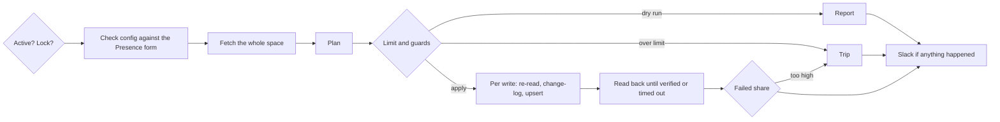

# Household match: design

When a canvasser records a Presence on one contact, every other contact at that address gets the household Presence value, so the household is not knocked again. The plan is [issue #1](https://github.com/TrellisCommons/qomon-automations/issues/1); this doc records how the code implements it and why. Operating it is in [the runbook](runbook.md). Qomon facts it relies on are in [the Qomon API notes](../integrations/qomon-api.md).

## Flow

Code: `apps/automations/src/jobs/household-match/` (`plan.ts` is pure; `run.ts` does the I/O), the key in `packages/address-match-core`.

## Run rules

1. A contact that already has any Presence value is never modified.
2. When a contact at an address has a canvassed Presence value, every other contact at that address without a Presence gets the space's household value. Every contact counts, not only voters.
3. Written values are never revisited.

A household value written by an earlier run is a Presence, so rule 1 protects it, and it is not canvassed, so it never triggers rule 2. Each run is therefore idempotent: it plans only what is still missing, which in steady state is the doors knocked since the last run.

Two contacts share an address when their [address keys](../../packages/address-match-core/README.md) are equal. A contact with no street number or street name has no key and is never matched (counted as `unkeyable`).

## Decisions

- **Per-space config, checked at start.** A space holds its canvassed values (an allowlist of stored values, not labels) and its household value. Every run checks both against the space's Presence form before planning and fails if one is missing, because Qomon drops an upsert naming an unknown value without an error. A value Qomon adds later (Moved, Deceased) does nothing until someone adds it to the allowlist.
- **One search per run, filtered in code.** Search returns each contact's Presence inline, and its `eql` is a token match, so the job fetches the whole space and applies the municipality filter itself. A contact whose city is blank is in scope.
- **The earliest canvassed Presence at an address is the trigger.** Its id is on every planned write. Qomon cannot set a Presence date, so the written date is when the write landed.
- **Re-read before each write.** Presence is one value per contact and an upsert replaces it, so a visit recorded between the fetch and the write would be overwritten. Each target is re-read just before its write and skipped if it now has a Presence or its address key changed. This narrows the race to a few seconds; Qomon has no conditional write to close it.
- **Verify every write.** Upsert answers 202 before doing anything. Writes go in batches of 20; each batch is read back every 3 seconds until every write shows the household value, shows some other value (failed), or `VERIFY_TIMEOUT_SECONDS` passes (failed).
- **Change log before the upsert.** Each write's `ChangeLogEntry` (before: no Presence; after: the household value and the trigger) is committed before the upsert is sent, so the audit trail never misses a write that reached Qomon. A write that then fails is marked `FAILED` on its `PlannedWrite`. The change-log table is append-only (a database trigger).
- **Backfill is the same run with an explicit limit.** The first run over a space with weeks of canvassing plans far more than `MAX_WRITES_PER_RUN`. `--backfill` records the run as a backfill and requires `--max-writes` to apply. Over that limit it writes nothing but leaves the space on, since a person chose the number.
- **A dedicated lock connection.** The advisory lock is held on its own `pg` connection, not Prisma's pool, so the unlock lands on the same session and a crashed run's lock goes with its connection.

## Write guards and circuit breakers

A write reaches Qomon only when `QOMON_WRITES_ALLOWED=true` (the droplet only), the space's `writesEnabled` is on (change-logged), and the run has `--apply`. Otherwise the run plans and reports. Turning a space on is refused where the environment does not allow writes.

| Breaker | Trips when | Then |
|---|---|---|
| Write limit (hourly) | planned writes exceed `MAX_WRITES_PER_RUN` (or `--max-writes`) | nothing written; space writes turned off; Slack alert; exit 2 |
| Write limit (backfill) | planned writes exceed `--max-writes` | nothing written; space left on; exit 2 |
| Failed share | at least `MIN_WRITES_FOR_FAILED_SHARE` writes attempted and more than `MAX_FAILED_SHARE` of them failed, checked after each batch | the run stops; space writes turned off; Slack alert; exit 2 |

## Storage

| Table | Holds |
|---|---|
| `space` | config, the encrypted Qomon API key (AES-256-GCM with `SPACE_SECRET_KEY`), `writesEnabled`, `activeUntil` |
| `job_run` | one row per run: kind (hourly or backfill), whether it applied, status, counts |
| `planned_write` | one row per planned change: Qomon contact id, trigger contact id, value, reason, outcome |
| `change_log_entry` | append-only audit trail of every change to Qomon or to a space |

No names, addresses, or Presence values of other contacts are stored: only Qomon ids, the trigger's value in the reason, and counts.

## Open questions

- Whether a Presence recorded from a phone or event campaign lands in the same form as a door knock (see the [Qomon API notes](../integrations/qomon-api.md)). If it does, rule 2 also fires for phoned contacts.
- Whether "Presence does exist" in Qomon's list builder agrees with what the job counts as having a Presence. Compare a dry run's counts with the list builder before turning writes on.
